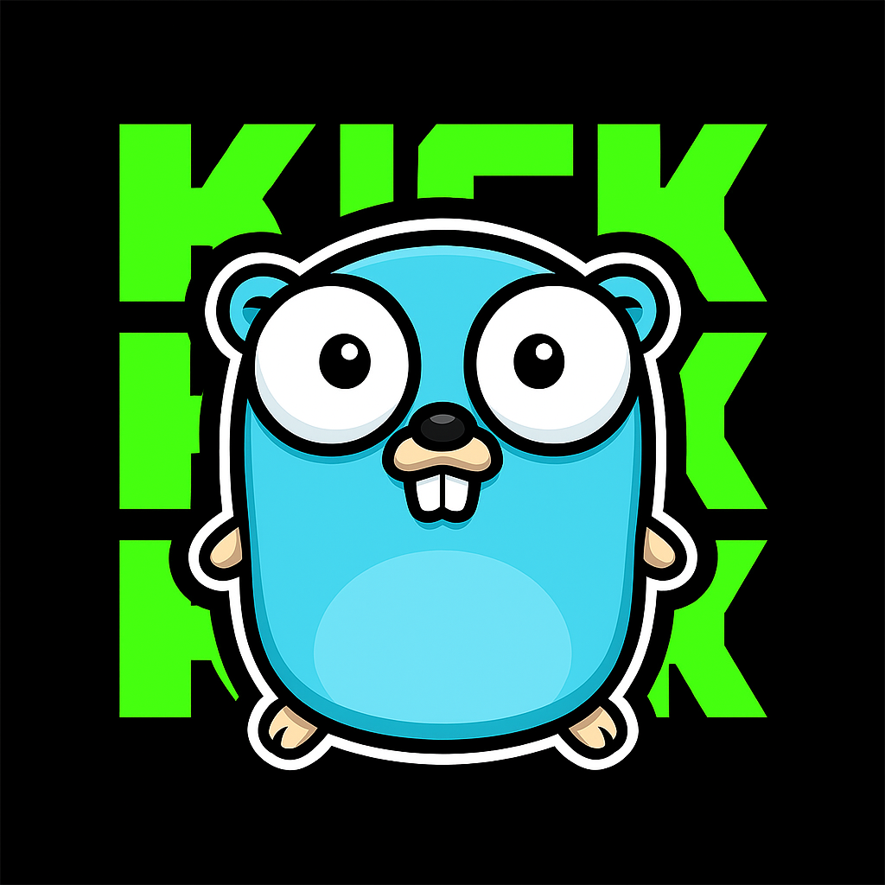

# Kick-SDK-Go  


## SDK for Kick API written in Go

The idea of this project is to provide ready-to-go Software Developer Kit (SDK) for communicating with Kick API. 
 
## Key features 

- Efficient and fast  
- Easy to integrate with Go web applications 
- Concurrent-safe -- compile to binary and use with goroutines 

## Examples and use-cases 

```go
package main 

import "github.com/pseudoerr/kick" 

func main() { 
	// initialize the backrground context
	ctx := context.Background()
	// simply pass your id and secret token to the constructor
	client := kick.NewClient("yourID", "yourSecret")
	// call a desired method
	categories, _ := client.GetCategories(ctx) 
    // do what you gotta do with this data!
	fmt.Println(categories)
}
``` 
More examples will be added in examples folder.

## Done: 

- DTO models 
- Project layout 
- HTTP layer + auth with options (app / user flows as defined in [Kick API docs]("https://docs.kick.com/getting-started/generating-tokens-oauth2-flow)") 
- Wire up the SDK logic in entrypoint 

## ToDo:  
- Define retry logic as a func option for Client 
- Add request/response logging
- Add rate limiting support
- Add custom error types 
- Structured Logging with custom errors 
- Full concurrency support 
- Makefile 
- Unit-testing with [net/http/httptest](https://pkg.go.dev/net/http/httptest)